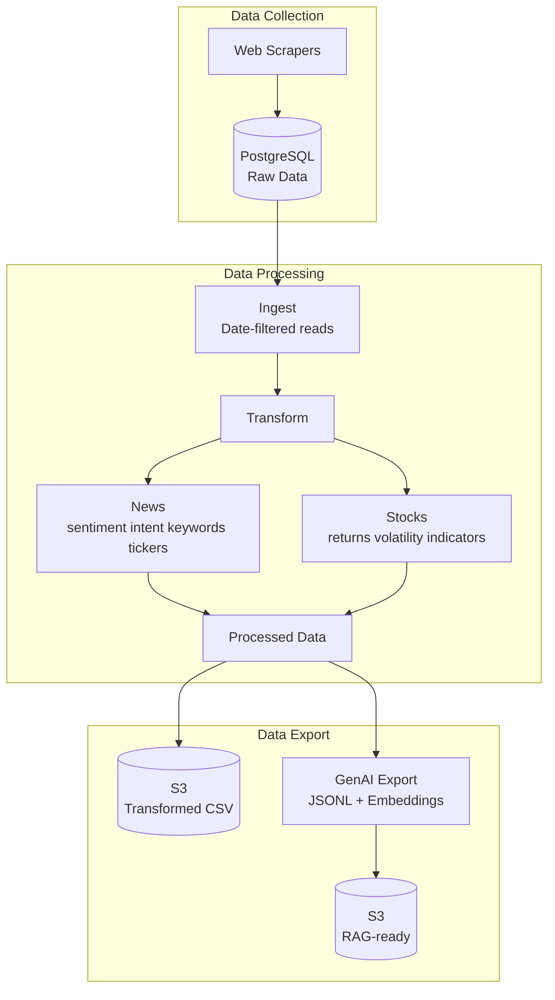

# Data Processing & Transformation Pipeline

Production-ready ETL transformation pipeline for financial data (stocks and news) with ML/NLP capabilities and GenAI export.

## Overview

This module provides comprehensive data transformation capabilities:

- **News Transformations**: Sentiment analysis, intent classification, keyword extraction, ticker extraction
- **Stock Transformations**: Returns, volatility, technical indicators  
- **GenAI Export**: JSONL format with optional embeddings for RAG applications
- **CLI Tools**: Command-line interface for production ETL operations

## Architecture



## Modules

### Text Transformers (`text_transformers.py`)

NLP transformations for financial news:

- **Sentiment Analysis**: VADER (fast), TextBlob, or Transformers (FinBERT)
- **Intent Extraction**: 8 categories (market_update, price_prediction, regulatory_news, etc.)
- **Keyword Extraction**: TF-IDF, spaCy NER, or RAKE
- **Text Preprocessing**: Clean URLs, HTML, normalize whitespace

### Ticker Extractor (`ticker_extractor.py`)

Extract cryptocurrency/stock tickers from text:

- Pattern matching: `BTC-USD`, `ETH-BTC`
- Parenthetical format: `Bitcoin (CRYPTO: BTC)`
- Name mapping: `bitcoin` → `BTC-USD`

### Stock Transformers (`stock_transformers.py`)

Financial transformations for OHLCV data:

- **Returns**: Log and simple returns
- **Volatility**: Rolling std, Parkinson, Garman-Klass
- **Technical Indicators**: SMA, EMA, RSI, MACD, Bollinger Bands
- **Risk Metrics**: Sharpe ratio, VaR, CVaR, max drawdown

### GenAI Export (`genai_export.py`)

Export for GenAI/RAG applications:

- **JSONL format**: One JSON object per line
- **Optional embeddings**: sentence-transformers vectors
- **Text chunking**: Split long articles for RAG
- **Metadata**: Tickers, sentiment, intent, keywords

### Pipeline (`pipeline.py`)

Orchestrates multi-stage pipelines:

- **Stages**: Scrape → Upload Raw → Transform → Upload Transformed → Export GenAI
- **Configuration**: Flexible stage selection and parameters
- **Error handling**: Continue on error or fail fast

### ETL CLI (`etl_cli.py`)

Command-line interface for production operations:

```bash
# Ingest data
python -m DataProcessing.etl_cli ingest-stocks --since 2026-01-01 --until 2026-01-28
python -m DataProcessing.etl_cli ingest-news --date 2026-01-27

# Transform data
python -m DataProcessing.etl_cli transform-stocks --since 2026-01-01 --output stocks.csv
python -m DataProcessing.etl_cli transform-news --date 2026-01-27 --sentiment vader

# Export for GenAI
python -m DataProcessing.etl_cli export-genai --date 2026-01-27 --embeddings
```

## Usage Examples

### News Transformation

```python
from DataProcessing.text_transformers import TextTransformationPipeline

# Initialize pipeline
pipeline = TextTransformationPipeline(
    sentiment_backend="vader",
    keyword_method="tfidf",
    extract_tickers=True
)

# Transform DataFrame
transformed_df = pipeline.transform(news_df)

# Result columns:
# - sentiment_label, sentiment_score, positive_score, negative_score, neutral_score
# - primary_intent, intent_confidence, secondary_intents
# - keywords, entities
# - tickers
# - cleaned_text, word_count
```

### Stock Transformation

```python
from DataProcessing.stock_transformers import StockTransformationPipeline

# Initialize pipeline
pipeline = StockTransformationPipeline(
    add_returns=True,
    add_volatility=True,
    add_indicators=True
)

# Transform OHLCV data
transformed_df = pipeline.transform(stocks_df)

# Result columns:
# - simple_return, log_return
# - volatility_20d, volatility_60d, volatility_parkinson, volatility_gk
# - sma_20, sma_50, sma_200, ema_12, ema_26
# - rsi_14, macd, macd_signal, macd_histogram
# - bb_upper, bb_middle, bb_lower
```

### Ticker Extraction

```python
from DataProcessing.ticker_extractor import TickerExtractor

extractor = TickerExtractor()

text = "Bitcoin (CRYPTO: BTC) and ETH-USD both rallied today."
result = extractor.extract_from_text(text)

print(result.tickers)  # ['BTC-USD', 'ETH-USD']
print(result.confidence)  # 0.95
```

### GenAI Export

```python
from DataProcessing.genai_export import export_to_jsonl, generate_embeddings

# Export to JSONL
export_to_jsonl(transformed_df, "output/news.jsonl")

# With embeddings for RAG
df_with_embeddings = generate_embeddings(transformed_df)
export_to_jsonl(df_with_embeddings, "output/news_rag.jsonl", include_embeddings=True)
```

### Full Pipeline

```python
from DataProcessing.pipeline import DataPipeline, PipelineConfig, PipelineStage

config = PipelineConfig(
    topics=["crypto"],
    s3_bucket="my-financial-data",
    stages=[
        PipelineStage.SCRAPE,
        PipelineStage.TRANSFORM,
        PipelineStage.EXPORT_GENAI
    ]
)

pipeline = DataPipeline(config)
result = pipeline.run()

print(f"Success: {result.success}")
print(f"Articles: {result.articles_transformed}")
print(f"Time: {result.execution_time_seconds}s")
```

## CLI Reference

### Ingest Commands

**Ingest Stocks:**
```bash
python -m DataProcessing.etl_cli ingest-stocks \
    --since 2026-01-01 \
    --until 2026-01-28 \
    --books btc-usd,eth-usd \
    --output raw_stocks.csv \
    --upload-s3
```

**Ingest News:**
```bash
python -m DataProcessing.etl_cli ingest-news \
    --date 2026-01-27 \
    --output raw_news.csv
```

### Transform Commands

**Transform Stocks:**
```bash
python -m DataProcessing.etl_cli transform-stocks \
    --since 2026-01-01 \
    --until 2026-01-28 \
    --output transformed_stocks.csv \
    --upload-s3
```

**Transform News:**
```bash
python -m DataProcessing.etl_cli transform-news \
    --date 2026-01-27 \
    --sentiment vader \
    --output transformed_news.csv
```

### Export Commands

**Export for GenAI:**
```bash
python -m DataProcessing.etl_cli export-genai \
    --date 2026-01-27 \
    --output news_genai.jsonl \
    --embeddings \
    --upload-s3
```

## Transformation Catalog

### News Transformations

| Feature | Description | Output |
|---------|-------------|--------|
| **Sentiment** | Positive/Negative/Neutral classification | `sentiment_label`, `sentiment_score` |
| **Intent** | Financial news category (8 types) | `primary_intent`, `intent_confidence` |
| **Keywords** | Top-N important terms | `keywords` (list) |
| **Entities** | Named entities (spaCy) | `entities` (list of dicts) |
| **Tickers** | Extracted crypto/stock symbols | `tickers` (list) |
| **Text Cleaning** | Remove URLs, HTML, normalize | `cleaned_text`, `word_count` |

**Intent Categories:**
- `market_update`: Market movements, trading activity
- `price_prediction`: Analyst forecasts, price targets
- `regulatory_news`: SEC, regulations, legal
- `company_news`: Earnings, M&A, corporate
- `technology_update`: Blockchain, protocol upgrades
- `analysis_opinion`: Expert commentary
- `breaking_news`: Urgent, developing stories
- `general_info`: Other

### Stock Transformations

| Feature | Description | Output |
|---------|-------------|--------|
| **Returns** | Price changes | `simple_return`, `log_return` |
| **Volatility** | Risk measures | `volatility_20d`, `volatility_60d`, `volatility_parkinson`, `volatility_gk` |
| **Moving Averages** | Trend indicators | `sma_20`, `sma_50`, `sma_200`, `ema_12`, `ema_26` |
| **RSI** | Momentum oscillator | `rsi_14` (0-100) |
| **MACD** | Trend following | `macd`, `macd_signal`, `macd_histogram` |
| **Bollinger Bands** | Volatility bands | `bb_upper`, `bb_middle`, `bb_lower` |

## Configuration

Environment variables (`.env` file):

```env
# ML/NLP Settings
ML_SENTIMENT_BACKEND=vader  # vader, textblob, transformers
ML_USE_TRANSFORMER_INTENTS=False
ML_KEYWORD_METHOD=tfidf  # tfidf, spacy, rake
ML_KEYWORD_TOP_N=10

# Pipeline Settings
PIPELINE_DEFAULT_TOPICS=crypto
PIPELINE_ENRICH_CONTENT=True
PIPELINE_S3_RAW_PREFIX=raw/news
PIPELINE_S3_TRANSFORMED_PREFIX=transformed/news
```

## Database Schema

### Transformed News Table

```sql
CREATE TABLE financial_news_transformed (
    id VARCHAR(255) PRIMARY KEY,
    -- Original fields
    source, headline, href, summary, content, datetime,
    -- Transformations
    cleaned_text TEXT,
    word_count INTEGER,
    tickers JSONB,
    sentiment_label VARCHAR(50),
    sentiment_score FLOAT,
    primary_intent VARCHAR(100),
    keywords JSONB,
    entities JSONB,
    ...
);
```

### Processed Stocks Table

```sql
CREATE TABLE historical_processed (
    book VARCHAR(255),
    date DATE,
    -- Original OHLCV
    open, high, low, close, adj_close, volume,
    -- Returns
    simple_return, log_return,
    -- Volatility
    volatility_20d, volatility_60d,
    -- Indicators
    sma_20, sma_50, sma_200, ema_12, ema_26,
    rsi_14, macd, macd_signal, bb_upper, bb_lower,
    ...
    PRIMARY KEY (book, date)
);
```

## GenAI/RAG Export Format

JSONL output structure:

```json
{
  "id": "12345",
  "title": "Bitcoin Surges Past $100,000",
  "summary": "Bitcoin reached a new all-time high...",
  "body": "Bitcoin surged past the $100,000 mark today...",
  "metadata": {
    "source": "Yahoo Finance",
    "datetime": "2026-01-27T10:30:00Z",
    "url": "https://finance.yahoo.com/...",
    "tickers": ["BTC-USD"],
    "sentiment": "positive",
    "sentiment_score": 0.85,
    "intent": "market_update",
    "keywords": ["bitcoin", "surge", "institutional", "adoption"]
  },
  "embedding": [0.123, -0.456, ...]  // Optional
}
```

## Testing

Run tests:

```bash
# All tests
pytest tests/

# With coverage
pytest tests/ --cov=DataProcessing --cov-report=html

# Specific test file
pytest tests/test_text_transformers.py -v

# Specific test
pytest tests/test_ticker_extractor.py::TestTickerExtractor::test_extract_standard_format -v
```

Test coverage:
- Unit tests for each transformer (ticker, sentiment, returns, volatility, indicators)
- Integration tests for full pipeline
- Mock S3/DB for isolated testing

## Dependencies

Required packages (see `requirements.txt`):

```txt
# NLP
nltk>=3.8.1                 # VADER sentiment
textblob>=0.17.1            # TextBlob sentiment
transformers>=4.30.0        # FinBERT, zero-shot
torch>=2.0.0                # For transformers
scikit-learn>=1.3.0         # TF-IDF

# Optional
spacy>=3.6.0                # NER, keyword extraction
sentence-transformers>=2.2.2  # Embeddings for RAG

# Data
pandas>=2.0.0
numpy>=1.24.0
```

Install:

```bash
pip install -e ".[dev]"

# Optional: spaCy model for NER
python -m spacy download en_core_web_sm

# Optional: Download NLTK data
python -m nltk.downloader vader_lexicon stopwords
```

## Performance Notes

### News Transformations

- **VADER**: ~1000 articles/sec (fastest, rule-based)
- **TextBlob**: ~500 articles/sec  
- **Transformers**: ~10-50 articles/sec (most accurate, GPU helps)
- **Ticker extraction**: ~2000 articles/sec
- **Embeddings**: ~50-200 articles/sec (depends on model, GPU)

**Recommendation**: Use VADER for production batch jobs, transformers for critical analysis.

### Stock Transformations

- **Returns/Volatility**: ~10,000 rows/sec
- **Technical Indicators**: ~5,000 rows/sec (per symbol)
- **Group-by symbol**: Essential for multi-symbol DataFrames

## Examples

See:
- [`pipeline_example.py`](pipeline_example.py) - Full pipeline examples
- `tests/` - Test files with usage patterns

## Integration with Existing ETL

### Current Flow
1. **Collect**: `StockCollector.ipynb`, `NewsCollector-Staging.ipynb` → PostgreSQL
2. **Ingest**: `DataIngestion-Stocks.ipynb`, `DataIngestion-Text.ipynb` → filter, export to S3

### Enhanced Flow (with this module)
1. **Collect**: (unchanged) → PostgreSQL raw tables
2. **Ingest**: CLI `ingest-stocks`/`ingest-news` (date-filtered reads)
3. **Transform**: CLI `transform-stocks`/`transform-news` → processed data
4. **Export**: 
   - S3 (CSV): partitioned by date/book
   - GenAI (JSONL): with embeddings for RAG
   - PostgreSQL: `historical_processed`, `financial_news_transformed`

### Migration Path

Replace notebook-based ingestion:

**Before** (manual notebook execution):
```
1. Run StockCollector.ipynb
2. Run DataIngestion-Stocks.ipynb (filter, export S3)
```

**After** (CLI/cron):
```bash
# Collect (keep existing or use script)
python WebScraping/run_stock_collector.py

# Transform and export (new)
python -m DataProcessing.etl_cli transform-stocks --since yesterday --upload-s3
```

## Scheduling

### Cron Example

```cron
# Daily at 6 AM: Collect and transform stocks
0 6 * * * cd /path/to/project && python -m DataProcessing.etl_cli transform-stocks --since yesterday --upload-s3

# Daily at 7 AM: Collect and transform news, export for GenAI
0 7 * * * cd /path/to/project && python -m DataProcessing.etl_cli transform-news --date today --upload-s3 && python -m DataProcessing.etl_cli export-genai --date today
```

### Airflow DAG (example)

```python
from airflow import DAG
from airflow.operators.bash import BashOperator

dag = DAG('financial_etl', schedule_interval='@daily')

transform_stocks = BashOperator(
    task_id='transform_stocks',
    bash_command='python -m DataProcessing.etl_cli transform-stocks --since {{ ds }}',
    dag=dag
)

transform_news = BashOperator(
    task_id='transform_news',
    bash_command='python -m DataProcessing.etl_cli transform-news --date {{ ds }}',
    dag=dag
)

export_genai = BashOperator(
    task_id='export_genai',
    bash_command='python -m DataProcessing.etl_cli export-genai --date {{ ds }}',
    dag=dag
)

transform_stocks >> transform_news >> export_genai
```

## Troubleshooting

**Import errors for transformers/spacy:**
- Install optional dependencies: `pip install transformers torch spacy`
- Download models: `python -m spacy download en_core_web_sm`

**NLTK data not found:**
```python
import nltk
nltk.download('vader_lexicon')
nltk.download('stopwords')
```

**S3 upload fails:**
- Check AWS credentials in `.env`
- Verify bucket name and permissions
- Test with `--output local_file.csv` first

**Transformation is slow:**
- Use VADER instead of transformers for sentiment
- Use TF-IDF instead of spaCy for keywords
- Disable embeddings (`--no-embeddings`)
- Process in smaller batches

## Contributing

When adding new transformers:

1. Inherit from `BaseTransformer` (abstract base class)
2. Implement `transform(text)` and `transform_batch(texts)`
3. Add to pipeline as a new stage
4. Write unit tests
5. Update this README

## License

MIT License - See root LICENSE file
